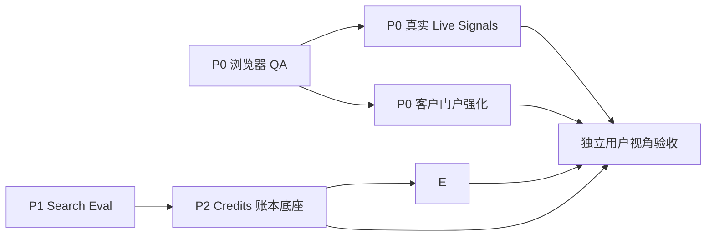

# DINQ 启发迭代计划：总体设计

日期：2026-07-30

## 决策

SignalHire 不复制 DINQ 的“公共人才库、黑盒自动搜人、自动群发”路线。本轮以既有 evidence-first recruiting workspace 为中心，按以下顺序补齐已经被用户体验和商业化卡住的闭环：

| 优先级 | 独立任务 | 用户结果 |
| --- | --- | --- |
| P0 | 浏览器 QA 基线 | 关键招聘团队和客户路径可被真实登录态重复验收。 |
| P0 | 客户门户强化 | 受邀客户可安全查看交付并反馈，反馈能追溯到真实账号与报告版本。 |
| P0 | Real Live Signal Provider v1 | `why now` 只使用可点击、可核验、可过期的真实公开信号。 |
| P1 | Search Eval v1 | 搜索质量、已知相关者召回、证据率和延迟有版本化基线。 |
| P1 | Talent Monitor v2 | 监控变成可配置、可审计、可暂停的持续搜人产品。 |
| P2 | Credits 与 Ops 后台 | 运营可人工加 Credits；搜索与监控预占、结算、失败释放，不接支付。 |

排除：Search API/MCP beta、候选人认领/纠错、公共职业社交网络、付费收款、自动发送首封邮件、无审核群发。

## 关键产品原则

1. **Evidence first。** 实时信号必须保留来源 URL、观察时间、置信度和到期时间；无来源或合成信号不触发 “why now”。
2. **人工保持控制权。** Monitor 发现的是待审阅候选人和证据变化，不自动外联。
3. **Credits 是账本，不是 UI 数字。** 每次会消耗积分的研究运行由服务端原子预占；成功结算，失败或取消释放；运营加额与每次变动均可审计。
4. **客户和运营权限分离。** 客户只能看到授权项目；`ops.<主域名>` 复用认证用户库和数据库，但采用独立 host-only 登录会话，只有 `OPS_ADMIN_EMAIL` 可进入。
5. **先测量，再改变默认路由或定价。** Search Eval v1 不改变用户搜索体验，不以“缓存命中”冒充质量提升。

## 依赖与交付顺序

业务优先级不等于代码依赖顺序：P1 Monitor 的产品界面、历史和调度可先完成；但其实际 Credits 扣减必须等待 P2 的账本底座完成，且不得自行改余额。

## 工程切分

- 每份 PRD 一个独立实现任务和独立验收清单，不把当前工作树中未提交的搜索、外联、demo 改动混入。
- 开发阶段采用 loop engineering：每个任务依次经过 red tests → 最小实现 → 受影响测试 → 独立代码审查 → 浏览器/接口验证。
- Credits 数据库/RPC 是跨任务公共底座。它只暴露 reserve / settle / release / grant / read-balance 的服务端接口；Monitor、搜索和 Role Agent 不可直接更新余额。
- 每个阶段结束后，由未参与实现的用户视角 agent 执行验收；任何 P0 blocker 先修复再进入下一阶段。

## 外部前置条件

- 真实 live-signal provider 的合规来源、访问许可和密钥；首版只接一个许可明确的公开源或供应商。
- 一个 owner QA 账号、一个受邀 customer QA 账号、包含报告/归档/候选人的 QA 项目，以及可用的浏览器自动化 bypass 配置。
- `ops.<主域名>` 绑定到同一 Next 应用的部署；`OPS_ADMIN_EMAIL` 在 server 环境配置。Ops 不共享父域 cookie。
- InsForge/数据库支持事务性 SQL/RPC；若不能原子完成 Credits 预占，Credits 不能上线。

## 全局完成定义

- 六份 PRD 的范围、排除项、数据契约、验收标准均被实现并可追溯。
- 不新增支付、候选人认领、API/MCP 或自动群发。
- 构建和受影响自动化测试通过；需要真实账号的浏览器验收有明确的通过证据或被标记为外部阻塞，绝不把缺少凭据误报为通过。
- 独立用户视角验收覆盖 recruiter、客户、运营三种角色，并完成所有 blocker 修复。
